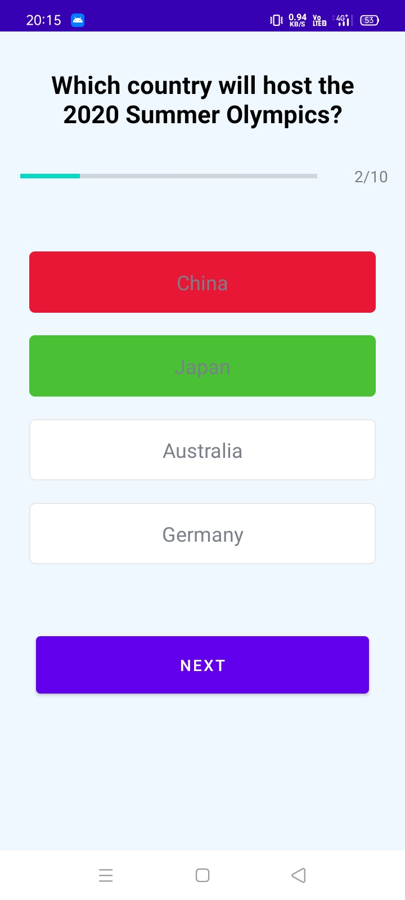

<h1 align="center"> Trivia Quiz App </h1>
 

 Quiz app using Trivia API 

# Description
 
 
Trivia Quiz app uses Trivia API to allow user to play Quiz game where user can choose category and difficulty. 

# Screenshots of our App

 

 

# Features

 * Good and simple UI
 * Option to choose from different categories
 * Give quiz on different difficulty levels

# Technologies,Libraries and Packages Used

 * Kotlin
 * Retrofit
 * Android Studio
 * Navigation Component
 * XML
 * Data Binding

# Local Setup
 
 1. Fork this repository
 2. Clone it in your local system
 3. Open Android Studio and select 'Open Project'. Browse through the file chooser to the folder where you have cloned the project. The file chooser will show an Android face as the folder icon, which you can select to open the project.
 4. After opening the project Android Studio will try to build the project directly. To build it manually, follow the menu path 'Build'/'Make Project', or just click the 'Play' button in the tool bar to build and run it in a mobile device or an emulator. The resulting .apk file will be saved in the 'build/outputs/apk/' subdirectory in the project folder.
 5. You can install the .apk file of Trivia Quiz app in your device and enjoy it’s enrich features.
